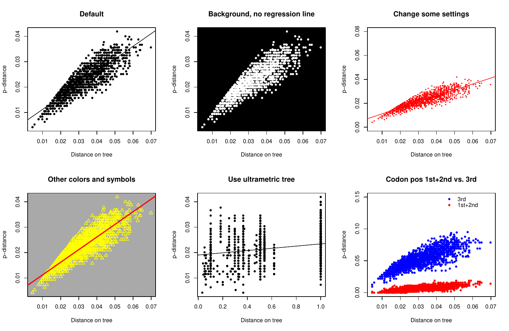

# Saturation plots - P-dist vs. Tree-dist

- Last modified: tis feb 20, 2024  05:54
- Sign: JN

## Description

Code for generating saturation plots used in [Klopfstein et al.,
2013](https://doi.org/10.1371/journal.pone.0069344) for displaying the
relationship between the uncorrected (P-) distance and the distance on a
phylogenetic tree.

## Requirements

[R](https://www.r-project.org/) with R-package
[ape](https://cloud.r-project.org/web/packages/ape/index.html).

Recently tested with R v4.3.2 and ape v5.7.1.

## Input

1. Multiple sequence alignment in fasta format ([example](data/data.fas))
2. Tree with tip labels corresponding to sequence labels
   ([example](data/tree.nex))

## Example

    > library("ape")
    > source("src/saturation.plot.R")
    > phy <- read.nexus("data/tree.nex")
    > dna <- read.dna("data/data.fas", format="fasta")
    > par(mfrow=c(2, 2))
    > saturation.plot(phy, dna, main="default")
    > saturation.plot(phy, dna, main="no box or regression",
                    bg=FALSE, reg=FALSE)
    > saturation.plot(phy, dna, main="change some settings",
                    bg=FALSE, col="red", xlim=c(15, 75),
                    ylim=c(0, 0.16), cex=0.5)
    > saturation.plot(phy, dna, main="other colors and symbols",
                    bg=TRUE, col="yellow", bg.col="darkgray",
                    pch=24, cex=1.5)

